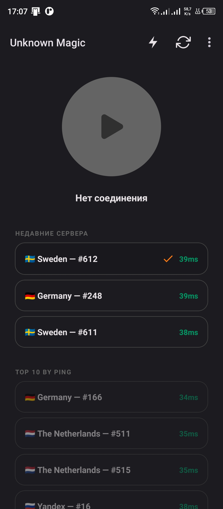

# UnknMagic

**UnknMagic** — это специализированный Android-клиент на базе [v2rayNG](https://github.com/2dust/v2rayNG), оптимизированный для работы в условиях жестких сетевых ограничений, таких как «белые списки» (когда доступ разрешен только к ограниченному перечню ресурсов).

[](https://developer.android.com/about/versions/lollipop)
[](https://kotlinlang.org)
[](https://github.com/2dust/v2rayNG/blob/master/LICENSE)

## Основные особенности

- **Вшитые сервера для обхода БС**: Приложение поставляется с предустановленным списком серверов, который обновляется автоматически. Пользователю не нужно искать или добавлять конфигурации вручную.
- **Упрощенный интерфейс**: Из приложения удалены функции ручного импорта, что делает его максимально доступным — «нажал и работает».

## Варианты сборки (Build Flavors)

В проекте реализовано два варианта сборки:

1.  **Free (Бесплатная)**: Базовая версия приложения. Включает основной функционал обхода ограничений со стандартным набором серверов. Именно эта версия публикуется в открытом доступе на GitHub.
2.  **Premium (Премиум)**: Расширенная версия с интеграцией системы лицензирования и доступом к премиум-серверам.

### Лицензирование и Премиум-функции

Функционал премиум-версии управляется через систему [LicenseChecker](https://github.com/UnknKriod/LicenseChecker) и [LicenseCheckerSubscriptionExtension](https://github.com/UnknKriod/LicenseCheckerSubscriptionExtension).

**Важное примечание для разработчиков:**
Механизмы авторизации и получения премиум-серверов требуют наличия проприетарных библиотек (AAR/JAR) в папке:
`UnknMagic/app/libs`

Без этих библиотек сборка `premium` версии будет невозможна или будет работать в ограниченном режиме.

## Скриншоты и демонстрация (Free версия)

Главный экран



Интерфейс приложения

<video src="github_assets/free_ui.mp4" width="300"></video>

## Технические подробности

- **Ядро**: Xray Core.
- **Протоколы**: VLESS, VMESS, Trojan и др.
- **Авто-обновление**: Реализовано через встроенный механизм подписок.

## Сборка

Для сборки конкретного варианта используйте следующие команды:

```bash
# Сборка бесплатной версии (GitHub)
./gradlew assembleFreeRelease

# Сборка премиум-версии (требует библиотеки в libs)
./gradlew assemblePremiumRelease
```

## Благодарности

Особая благодарность [zieng2](https://github.com/zieng2) за предоставление и поддержку [подписки с профилями](https://github.com/zieng2/wl) для обхода белых списков. Данный клиент создан для удобного использования этих профилей.

## Отказ от ответственности (Disclaimer)

1. **Использование на свой страх и риск**: Данное программное обеспечение предоставляется «как есть» (as is). Авторы не несут ответственности за возможный ущерб, потерю данных или блокировки аккаунтов, возникшие в результате использования данного приложения.
2. **Соблюдение законодательства**: Пользователь несет полную личную ответственность за соблюдение местного законодательства при использовании инструментов для изменения сетевого трафика.
3. **Отсутствие гарантий**: Авторы не гарантируют 100% доступность серверов или обход всех видов сетевых ограничений, так как это зависит от условий интернет-провайдеров и действий третьих лиц.
4. **Конфиденциальность**: Приложение не собирает личные данные, кроме тех, что необходимы для работы системы лицензирования в премиум-версии.
